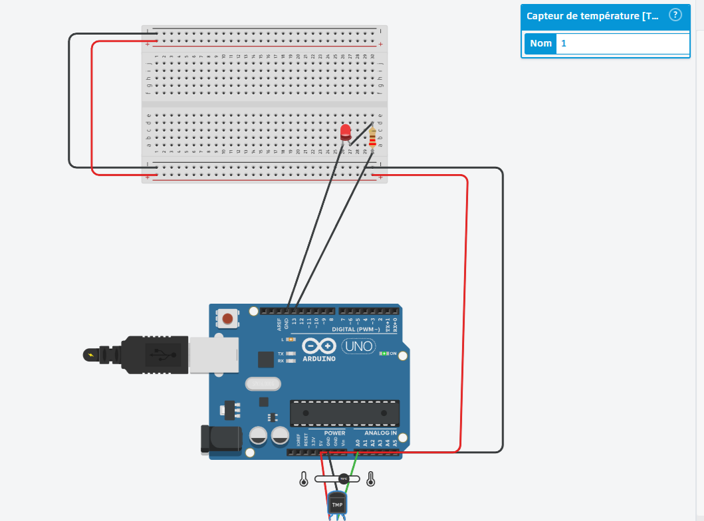

# Alarme Thermique Industrielle

## Description
Ce projet est un prototype de système d'alerte thermique automatisé, développé en C++ sur microcontrôleur Arduino. Il a été conçu pour simuler la surveillance de température d'infrastructures critiques : si la température dépasse le seuil critique de 50°C, une alarme visuelle s'enclenche instantanément.

## Architecture & Technologies
- Microcontrôleur : Arduino Uno R3
- Langage : C++ (Logique embarquée et traitement de signaux analogiques)
- Capteur : TMP36 (Capteur de température analogique)
- Actionneur :Diode Électroluminescente (LED) d'alerte avec résistance 220Ω
- Environnement : Prototypage virtuel sur Autodesk Tinkercad

## Aperçu du Montage
*(Le câblage a été réalisé virtuellement pour valider la logique avant l'implémentation physique)*

## Logique de Fonctionnement (Algorithme)
1. Acquisition : Lecture en boucle (`loop`) de la tension analogique (0-1023) générée par le capteur TMP36 sur la broche A0.
2. Conversion : Traitement mathématique du signal brut en Volts, puis conversion en degrés Celsius.
3. Surveillance : Affichage des données en temps réel sur le Moniteur Série.
4. Déclenchement : Condition booléenne (`if/else`) activant la broche numérique 13 en cas de dépassement du seuil de 50°C.
